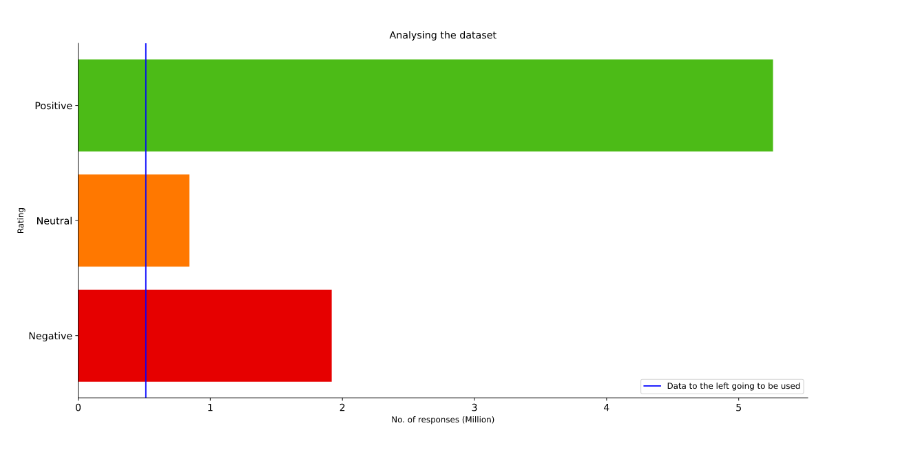

# Ripe-Tomatoes
A Discord bot which can classify comment sentiments on the fly.

## Sentiment Analyser
This model can classify comment sentiments into 3 classes: Positive, Neutral and Negative. 
### Dataset Used
[Yelp dataset](https://www.yelp.com/dataset).
Originally this dataset contains around *8 million* samples of reviews collected by Yelp over the years. These samples have stars rating from 1 to 5. For my usecase, I have grouped the star ratings to 3 broad categories.

* 1 and 2 stars - Negative
* 3 stars - Neutral
* 4 and 5 stars - Positive

But since I had limited resources, I used _1.2 million_ reviews. Another reason why I used these many reviews was also to maintain equal number of samples for all three classes. I took _512k_ samples for each class.

This is their distribution:

### Model
The [model](main_model.ipynb) used here is a combination of 1d convolutions and bidirectional LSTMs with also an added Embedding layer of 50 dimensions. The model had a test accuracy of ≈ **82%**. You can use the [predictor.py](predictor.py) file to test the code in your computer.

## Discord Bot
 The bot has been made using Discord's [discord.py](https://discordpy.readthedocs.io/en/latest/) api. Its super easy to learn and make bots. I was able to deploy my bot online thanks to [Heroku](https://www.heroku.com)'s free dyno. The scripts I have used are:
 * [bot.py](bot.py) : This script runs the bot and is the main program for the bot
 * [requirements.txt](requirements.txt): This script contains all the necessary libraries required to run the bot on Heroku.
 * [Procfile](Procfile): This file tells Heroku server what file does it needs to run first.

Join this [server](https://discord.gg/v5cVpt) to test the bot!
